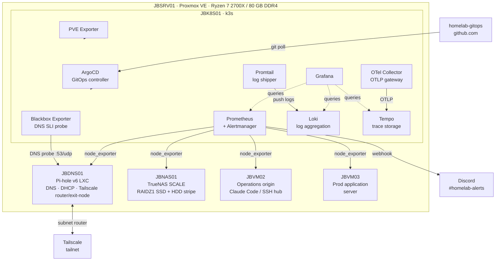

# homelab-gitops

Personal homelab built from bare metal up. Started as traditional sysadmin work (VMs, NAS, networking) and grew into a full GitOps and Kubernetes platform. Everything here runs in production on a single Proxmox host at home.

The goal isn't a perfect setup. It's understanding why production engineers make the choices they do, not just getting the tools running. [Lessons Learned](#lessons-learned) at the bottom documents what broke along the way.

---

## Architecture



---

## Infrastructure

| Host | Role | OS | Resources |
|------|------|----|-----------|
| JBSRV01 | Proxmox hypervisor | Proxmox VE (Debian) | Ryzen 7 2700X · 80 GB DDR4 |
| JBDNS01 | Pi-hole DNS + DHCP + Tailscale | Debian 12 LXC | 2 vCPU · 512 MB |
| JBNAS01 | TrueNAS SCALE NAS | TrueNAS SCALE 25.04 | 4 vCPU · 12 GB · RAIDZ1 SSD + HDD stripe |
| JBK8S01 | k3s cluster | Ubuntu 24.04 | 4 vCPU · 8 GB · 40 GB |
| JBVM01 | Jump box / desktop | Debian 13 | 2 vCPU · 2 GB |
| JBVM02 | Operations origin | Ubuntu 24.04 | 2 vCPU · 8 GB |
| JBVM03 | Production application server | Ubuntu 24.04 | 6 vCPU · 14 GB |

Total guest allocation: 19 vCPU on a 16-thread host, a mild overcommit (see [Design Decisions](#design-decisions)).

---

## Build Journey

This project grew in phases. The goal wasn't just to get things working but to understand why engineers in real production environments make the choices they do.

### Foundation: bare metal to virtualised estate

Starting point: a single Proxmox host with VMs provisioned manually through the GUI. Network DNS and DHCP were handled by the Virgin Media hub, which meant no local control, no filtering, and no internal name resolution. The NAS was a stripe pool with a faulted drive.

Replaced all of it: Pi-hole for network-wide DNS, DHCP, and ad-blocking; TrueNAS SCALE with a proper two-pool ZFS layout (RAIDZ1 for data I care about, stripe for media I can re-acquire); Tailscale via a single subnet router so the whole LAN is reachable without per-host installation or port forwarding.

The homelab docs live in a private repo; this one covers only the k8s cluster and the decisions behind it.

### Phase 1: k3s + full observability stack ✓

The first choice was k3s over kubeadm. Same production Kubernetes API surface, without managing a multi-component control plane on a single node. From day one the cluster managed itself: ArgoCD was the first thing applied, then made to watch its own Helm values so upgrades are Git PRs, not `helm upgrade` commands.

Observability came next and went further than most homelab setups bother with: kube-prometheus-stack for metrics and alerting, PVE Exporter scraping the Proxmox REST API for hypervisor and guest metrics, node_exporter on every host in the estate including the NAS and the Proxmox hypervisor itself, Grafana dashboards auto-provisioned from ConfigMaps generated by a Python script (so dashboard diffs are readable), and Alertmanager routing real alerts to Discord. The `CPUThrottlingHigh` and `initChownData` entries in Lessons Learned came out of this phase.

**What this gave me:**
- Experience navigating custom Grafana dashboards with real data, which shaped my instinct for what panels matter first and what the numbers are actually telling you
- A working understanding of how Prometheus alerting behaves in practice, including cases where the alert fires and the graphs look fine
- First-hand experience with GitOps as a workflow: proposing a change, seeing ArgoCD apply it, and understanding what drift detection looks like when the live cluster diverges from Git


<br>


### Phase 2: centralised logging + distributed tracing ✓

Added Loki in SingleBinary mode. No gateway, no compactor overhead, which is right for a single-node homelab. Retention is 7 days on a local-path PV. Promtail runs as a DaemonSet for in-cluster pod logs and as a standalone agent on all six external hosts (NAS, jump box, operations VM, production server, DNS/DHCP LXC, Proxmox hypervisor), shipping systemd journal and syslog over the network. The hypervisor also ships kern.log, which provides visibility into SATA and disk-level kernel events.

Added Grafana Tempo for distributed trace storage and an OpenTelemetry Collector as the trace ingestion gateway. The Collector receives OTLP over gRPC (:4317) and HTTP (:4318) and forwards to Tempo. The Grafana Tempo datasource is wired with trace-to-logs (Loki) and trace-to-metrics (Prometheus) correlation, so a trace span jumps directly to the matching log lines and metrics window. No services currently emit OTLP traces; the pipeline is ready for when they do.

The interesting part of this phase wasn't the software. It was learning how Loki's label cardinality model differs from Prometheus's, why the `uid` field on Grafana datasources matters more in version 13 than it used to, and how the OTel Collector sits as a decoupled telemetry pipeline -- you can fan out to multiple backends (Tempo + Jaeger + cloud) without touching the instrumented services.

**What this gave me:**
- Experience querying logs across multiple hosts from a single interface, which showed me concretely what centralised logging changes about how you investigate a problem
- An understanding of how pod logs and host-level systemd journal entries relate, and why having both in one place matters when tracing a failure
- Practical exposure to log label design: I hit the cardinality problem myself and learned why it matters before encountering it in a production context
- A working understanding of the OTel Collector as a vendor-neutral telemetry pipeline (receivers, processors, exporters, pipelines), and how Grafana's three datasources -- Prometheus, Loki, Tempo -- correlate across signals


<br>


### Phase 3: IaC and GitOps hardening ✓

Three gaps closed in this phase:

**Secrets in Git**: credentials were previously applied manually and lived outside version control. Migrated to Bitnami Sealed Secrets. The Discord webhook and Proxmox API token are now `SealedSecret` CRDs in `charts/secrets/`, encrypted asymmetrically against the cluster's master key. The encrypted blobs are safe to commit publicly. Cluster rebuild now requires one secret (the master key backup) instead of recreating every credential from memory.

**Infrastructure as code**: all six guests on the Proxmox host (four VMs plus the Pi-hole LXC plus the k3s VM, which was the last one to come under management) are described in OpenTofu (`tofu/`) using the bpg/proxmox provider. Existing infra was imported into state rather than rebuilt. The import process surfaced several provider quirks documented in Lessons Learned. Maintaining IaC is its own operating cost: live changes made via `pct set` or `qm set` produce silent drift between HCL and state, and a blind `tofu apply` after that drift would have stripped boot-order config and broken startup sequencing. The discipline that keeps the lid on is treating any non-empty `tofu plan` as a defect, not a deferred task, and closing the loop in the same change window the live edit was made.

**CI**: GitHub Actions runs on every push and PR. `yamllint` on all YAML (excluding sealed secret blobs whose encrypted content exceeds line limits by design) and `helm dependency update` + `helm lint` across all five umbrella charts.

**What this gave me:**
- Experience importing live infrastructure into IaC rather than starting greenfield, which is almost always how it works in practice
- An understanding of what a `tofu plan` diff actually communicates and why reviewing it before apply matters, not just as a concept but from having worked through real provider quirks to get there
- Exposure to secrets management as a workflow: encrypting credentials before they touch Git, and understanding what the controller needs to take ownership of an existing secret
- A working CI pipeline I built and debugged myself, which gave me a clearer picture of where lint gates fit into a GitOps deployment flow


<br>


### Phase 4: SLOs and the family-services workload ✓

The earlier phases got every service emitting metrics and every host shipping logs. What was missing was a definition of *what good looks like*. "Up" is a binary signal that hides the failure modes users actually feel; an SLO turns it into a quality bar with a time horizon and an error budget. Five family-services SLOs went in: Plex (99.5%), Minecraft (99.0%), Pi-hole DNS (99.9%), NAS reachable (99.9%), Tailscale node (99.0%). Each is implemented as a multi-window multi-burn-rate alert pair following the Google SRE Workbook §5.4 pattern (fast-burn 1h+5m, slow-burn 6h+30m), so a real outage pages within minutes while a slow degradation still surfaces before the monthly budget is exhausted.

Backing the SLOs required new metric sources for places k3s can't see. `smartctl_exporter` runs on the Proxmox host directly, because the NAS VM sees QEMU virtio devices not real disks and SMART has to be collected at the hypervisor. `mc-monitor` polls the Minecraft server via server-list-ping rather than RCON, so it measures what a player's client actually does. `tailscaled --debug` exposes per-node Tailscale health on a LAN-bound port. Two in-cluster polling exporters (`pihole-exporter`, `plex-exporter`) cover the Pi-hole admin API and Plex Media Server. Backup last-success timestamps land in Prometheus via node_exporter's textfile collector: each of the five backup-shaped scripts writes an atomic `backup_last_success_timestamp_seconds` heartbeat on its success branch. Three new dashboards generated from `gen-dashboards.py`: Family Services SLO, Capacity/Backup-DR (live cadence-aware tiles, not a static markdown stub), and Logs+Network/DNS.

The most interesting outcome of this phase wasn't the SLOs themselves but the day-1 false alarm they produced. The Pi-hole SLI was `up{job="pihole"}` — exporter scrape success against the admin API on :80. It paged critical for six hours while household DNS resolution was fine. The lesson, written up in [Lessons Learned](#lessons-learned), pushed the next iteration: `prometheus-blackbox-exporter` probing the actual service port (53/udp) backs the critical alert; the original exporter-scrape signal stays in place at warning severity as exporter-health monitoring. Two different failure modes, two different alerts, two different severities.

**What this gave me:**
- First-hand exposure to the multi-window multi-burn-rate alert pattern from the Google SRE Workbook, not from a blog post but from translating the maths into actual PromQL recording rules and reading the alert at 04:00 BST when it fires
- A working understanding of what it means to choose an SLI: the difference between a metric of convenience (whatever's easy to express) and a metric of user experience, and the operator-trust cost when those diverge
- Experience separating SLIs into matched pairs (probe + exporter, critical + warning) so each failure mode produces a distinct signal rather than collapsing into one ambiguous alert


---

## Stack

| Component | Tool | Why |
|-----------|------|-----|
| Hypervisor | Proxmox VE | KVM-based; all VMs and LXC container described as code via OpenTofu |
| IaC | OpenTofu + bpg/proxmox | VM/LXC definitions in `tofu/`; existing infra imported into state; state kept locally on JBVM02 (gitignored) |
| DNS + DHCP | Pi-hole v6 (LXC) | Network-wide ad-blocking + DHCP takeover; Virgin Media Hub's DHCP disabled entirely; LXC keeps footprint minimal |
| Off-network access | Tailscale | Mesh VPN; single subnet router on JBDNS01 exposes the full LAN without port forwarding or per-host installation |
| NAS | TrueNAS SCALE | ZFS for data integrity and snapshots; two-pool design maps durability requirements to hardware (RAIDZ1 for data, stripe for media) |
| Container orchestration | k3s | Production Kubernetes API surface without kubeadm complexity; includes Traefik, CoreDNS, and metrics-server |
| GitOps | ArgoCD | Declarative cluster state from Git; self-managing via App of Apps; automated sync + prune + selfHeal on every push |
| Dependency updates | Renovate | Weekly automated PRs for Helm chart version bumps; `managerFilePatterns` targets `charts/.+/values.yaml` |
| Secrets management | Sealed Secrets | Bitnami controller decrypts `SealedSecret` CRDs in-cluster; encrypted blobs safe to commit; master key backed up off-cluster |
| Metrics + alerting | kube-prometheus-stack | Prometheus + Grafana + Alertmanager stack with CRD-based config that matches production patterns |
| Proxmox metrics | PVE Exporter | Proxy-style scraping of Proxmox host and guest metrics via the Proxmox REST API |
| Service exporters | pihole-exporter, plex-exporter | In-cluster exporters polling external services (Pi-hole admin API on JBDNS01, Plex on the Shield); migrated from static `additionalScrapeConfigs` to ServiceMonitor with a `job=` relabel so existing recording rules keep matching |
| Blackbox probe | prometheus-blackbox-exporter | Real user-DNS SLI on JBDNS01:53/udp (module `dns_pihole`, `valid_rcodes: [NOERROR]`); backs critical `PiholeDnsBurnFast` separately from the exporter-scrape SLI |
| Host-side exporters | smartctl-exporter, mc-monitor, tailscaled `/debug`, node_exporter textfile | Metrics from places k3s can't reach: SMART on the Proxmox host (the NAS VM sees virtio devices, not real disks, so SMART has to be collected at the hypervisor), Minecraft availability via server-list-ping, Tailscale node health, and backup last-success heartbeats from cron/systemd-timer scripts. Pure systemd binaries; no Helm or k8s. |
| Dashboards | Grafana + ConfigMap sidecar | Auto-provisioned from Git-tracked ConfigMaps; JSON generated by a checked-in Python script for readable diffs |
| Alert routing | Alertmanager -> Discord | Webhook routing to `#homelab-alerts`; Watchdog heartbeat silenced; k3s-incompatible monitors disabled |
| Log aggregation | Loki (SingleBinary) | Centralised log storage with 7-day retention on a local-path PV; no gateway, direct push from Promtail |
| Log shipping | Promtail (DaemonSet + external) | In-cluster DaemonSet ships pod logs; external agents on all six estate hosts (JBNAS01, JBVM01, JBVM02, JBVM03, JBDNS01, JBSRV01) ship systemd journal + syslog via NodePort 31100 |
| Distributed tracing | Grafana Tempo (SingleBinary) | Trace storage with 7-day retention on a local-path PV; receives from OTel Collector; wired to Grafana with trace-to-logs and trace-to-metrics correlation |
| Trace pipeline | OpenTelemetry Collector | Vendor-neutral OTLP gateway; receives traces over gRPC (:4317) and HTTP (:4318), forwards to Tempo; decouples instrumented services from the backend |
| CI | GitHub Actions | Helm lint + YAML validation on every PR; Node.js 24 runner |

---

## Design Decisions

**NodePort over LoadBalancer for cluster services**
k3s ships Traefik as the default ingress and ServiceLB (klipper-lb) binds it to ports 80 and 443 on the node IP. Any other service with `type: LoadBalancer` on those ports stays `Pending` indefinitely. All non-Traefik services in this repo use `type: NodePort` with explicit port assignments to avoid the conflict.

**`local-path` PV over NFS for persistent volumes**
Mounting NAS-backed NFS as PV storage would make cluster availability depend on NAS availability. On a single Proxmox host, both are VMs; a cascading failure would take down the cluster and its storage simultaneously. `local-path` keeps the failure domain to the k3s VM itself. No live migration is possible, but that doesn't matter on a single-node cluster.

**Plain YAML for PVE Exporter, not a Helm umbrella chart**
No upstream Helm chart exists in prometheus-community for PVE Exporter. Wrapping a Deployment and a Service in a custom umbrella chart adds abstraction without value. Plain YAML under `charts/pve-exporter/` with an ArgoCD Application that omits the `helm:` block works identically; ArgoCD auto-detects plain YAML.

**Proxy-style Prometheus scraping for Proxmox**
The PVE Exporter follows the [multi-target exporter pattern](https://prometheus.io/docs/guides/multi-target-exporter/): Prometheus sends `GET /pve?target=<proxmox-ip>&module=default` and the exporter calls the Proxmox REST API on behalf of Prometheus. One exporter instance serves metrics for the entire Proxmox host and all guests. The API token lives in a k8s Secret, not in the scrape config.

**Dashboard JSON generated from a checked-in Python script**
Grafana dashboards imported manually through the UI are stored in Grafana's SQLite database; they don't survive a pod replacement or PV wipe. Provisioning via ConfigMaps means the sidecar re-applies all dashboards on every Grafana restart, making dashboard state declarative and version-controlled. The secondary problem is that dashboard JSON exported from the UI runs to 4000+ lines of opaque nested objects; a diff between two versions is unreadable. `charts/dashboards/gen-dashboards.py` generates the ConfigMap YAML from a structured Python definition so a change to a single panel produces a meaningful diff rather than a wall of JSON noise.

**Self-managing ArgoCD**
ArgoCD watches its own Helm values at `charts/argocd/values.yaml`. Upgrades are Git PRs, not manual `helm upgrade` runs. This was the first application applied to the cluster; from that point the cluster's desired state is fully described in Git.

**App of Apps bootstrap**
A root Application at `bootstrap/root-app.yaml` watches the `apps/` directory. Applied once manually on a new cluster; all subsequent applications are live on push. No `kubectl apply` needed for new additions; push an Application manifest to `apps/` and ArgoCD handles the rest.

**Sealed Secrets for in-Git credentials**
The Alertmanager Discord webhook URL and Proxmox API token live in `charts/secrets/` as `SealedSecret` CRDs. The Bitnami Sealed Secrets controller decrypts them in-cluster using a master key that never leaves the cluster. The encrypted blobs are useless without that key, so committing them is safe even on a public repo. Cluster rebuild now requires only the master key restore (one secret) instead of recreating every credential by hand. The master key is itself a critical out-of-Git artefact and is backed up off the cluster.

**vCPU overcommit: 19 vCPU on a 16-thread host**
JBVM03 (6 vCPU) and the k8s observability stack (4 vCPU) have non-overlapping peak windows. The application's CPU-intensive periods don't coincide with Prometheus scrape and Grafana query load. The overcommit is monitored via the PVE Exporter dashboard.

**Two-pool NAS design**
`JBNAS_SSD` (RAIDZ1, 3x 512 GB SSD) holds general data and project backups; redundancy matters here. `JBNAS_MEDIA` (stripe, 4x HDD) holds the Plex media library; media is re-acquirable, so full capacity at the cost of redundancy is the right call. Different durability requirements, different ZFS topologies.

**Write-only SMB drop pattern**
The jump box mounts the Media share as a restricted identity (`jbannon`) with POSIX ACLs granting `write+execute` on `_inbox/{movies,tv}/` only; it cannot read, list, or overwrite the live library. A cron-driven mover uses atomic renames within the same ZFS dataset to sweep files into `Movies/`/`TV/`, so Plex never sees a partial file. A 100 GB per-user ZFS quota bounds exposure if the jump box identity is compromised.

**Single Tailscale node as subnet router**
Installing Tailscale on every VM would require per-host ACL entries and key rotation across the estate. Instead, JBDNS01 acts as a subnet router advertising `192.168.0.0/24` and as an exit node. One Tailscale node exposes the entire LAN; clients connect with `--accept-routes` and reach every host without Tailscale installed on them.

**Deliberately single-environment GitOps**
This repo has no `environments/` overlay structure; this homelab has one cluster. Production would layer Kustomize overlays (or per-environment Helm value files) over a base config: `base/` -> `overlays/dev/`, `overlays/prod/`. That pattern is absent here by choice, not by accident.

**Migrate static scrape configs to ServiceMonitor with a `job=` relabel**
The kube-prometheus-stack convention is that in-cluster targets use ServiceMonitor and `additionalScrapeConfigs` is reserved for targets outside the cluster. Migrating an existing in-cluster exporter from a static `additionalScrapeConfigs` job entry to a ServiceMonitor changes the resulting `job` label: a ServiceMonitor named `pihole-exporter` in the `monitoring` namespace produces `job="monitoring/pihole-exporter"` by default, not the original `job="pihole"`. Recording rules and dashboards that reference `up{job="pihole"}` silently stop matching.

A one-line relabel preserves the original label:
```yaml
endpoints:
  - port: metrics
    relabelings:
      - targetLabel: job
        replacement: pihole
```
The migration becomes an atomic single commit: add the ServiceMonitor, remove the static job, no recording-rule rewrite. The alternative (rewrite every recording rule and dashboard to the new ns/name shape) is possible but has a much larger blast radius for what is structurally a label-shape change. Dropping the relabel later is a cosmetic follow-up that doesn't have to block the migration.

---

## Lessons Learned

Things that didn't work the first time and why.

**`CPUThrottlingHigh` fires even when average CPU usage is negligible**
Symptom: Alertmanager fires `CPUThrottlingHigh` on the PVE Exporter pod; `kubectl top pod` shows roughly 8m average CPU, so the workload appears healthy.
Diagnosis: query `rate(container_cpu_throttled_seconds_total[5m])` in Prometheus directly. If throttle events are high while average usage looks normal, it confirms burst throttling rather than sustained load. The `CPUThrottlingHigh` rule fires when the ratio of throttled time to total scheduled time exceeds 25% over 15 minutes, regardless of average utilisation.
Root cause: `container_cpu_throttled_seconds_total` counts cgroup throttle events, not average utilisation. The Python/gunicorn PVE Exporter spikes CPU on every Prometheus scrape burst; with a `limits.cpu: 100m` ceiling it was rate-limited on nearly every scrape window despite the negligible average.
Fix: raise `limits.cpu` (`100m` -> `500m`). Leave `requests.cpu` unchanged; it drives scheduling, not enforcement. The alert can remain firing for up to 20 minutes after the fix deploys while Prometheus burns down the `for` window and Alertmanager waits out `resolve_timeout`.

**Grafana sidecar reload returns 401 despite correct-looking credentials**
Symptom: sidecar writes dashboard JSON to `/tmp/dashboards/` but dashboards don't appear in the Grafana UI; sidecar logs show `401 Unauthorized` on the provisioning reload API call.
Root cause: during initial deploy ArgoCD cycled multiple Grafana ReplicaSets. Each cycle regenerated the `kube-prometheus-stack-grafana` k8s Secret with a new admin password, but the Grafana SQLite database on the persistent volume retained the original. The Secret and the DB diverged silently; the sidecar's reload call used Secret credentials against a DB that didn't match. The same divergence happens on every Renovate-driven chart upgrade.
Fix: reset the Grafana admin password via `grafana cli admin reset-admin-password` to match the current Secret value. Note: the Grafana container ships BusyBox `wget`, which lacks `--user`/`--password` flags; use `--header "Authorization: Basic $(echo -n user:pass | base64)"` for scripted API calls against the Grafana HTTP API.
Follow-up: rather than running this recipe by hand after every chart upgrade, an ArgoCD `PostSync` hook (`charts/kube-prometheus-stack/templates/grafana-password-sync-job.yaml`) now reconciles the password automatically. Small Job, narrow RBAC (one Secret + one Deployment in the monitoring namespace), `BeforeHookCreation` cleanup so completed Jobs don't accumulate. Eliminates the manual step entirely; the manual recipe stays in the homelab docs as a fallback for when the Job itself fails. Worth seeing if "I documented a workaround" is good but "I deleted the workaround" is better.

**Sealed Secrets controller refuses to overwrite pre-existing Secrets**
Symptom: `SealedSecret` CRD applied successfully (status `Synced: True`) but the underlying `Secret` did not change; consumer pod still reading the old value. No errors in the controller logs.
Root cause: by default the controller will not take ownership of a `Secret` it did not create. If the target `Secret` already exists in the namespace (e.g., previously created by `kubectl apply`), the controller leaves it untouched to avoid clobbering data that may pre-date sealed-secrets adoption.
Fix: annotate the existing target with `sealedsecrets.bitnami.com/managed: "true"` before applying the `SealedSecret`. The controller then updates the existing `Secret` in place. Pod restart is not required if the new value matches the old one.

**`additionalDataSources` entries silently skipped in Grafana 13 without a `uid` field**
Symptom: Loki listed in `additionalDataSources` in `values.yaml`; provisioning ConfigMap contains the entry and is mounted in the pod; Grafana API returns only Prometheus and Alertmanager; Logs Drilldown shows "no Loki datasource configured." No error in Grafana logs.
Root cause: Grafana 13 requires a `uid` field on each datasource entry in provisioning config. Entries without one are silently skipped at startup. The other datasources (Prometheus, Alertmanager) carry a `uid` in the kube-prometheus-stack defaults; the Loki entry was added without one.
Fix: add `uid: loki` to the Loki entry in `additionalDataSources`. The value is arbitrary but must be present.

**`prometheus-operator` ignores Secret content changes**
Symptom: new scrape job added to `additionalScrapeConfigs` in `values.yaml`; ArgoCD shows `Synced Healthy`; Secret content is correct in the cluster; the job is absent from the live Prometheus config inside the pod.
Root cause: prometheus-operator reconciles when its CRDs (ServiceMonitor, PodMonitor, PrometheusRule, etc.) change, not when a referenced Secret's content changes. Updating the `additionalScrapeConfigs` Secret alone does not trigger a config reload.
Fix: `kubectl rollout restart deployment kube-prometheus-stack-operator -n monitoring`. The operator re-reads all referenced Secrets on startup.

**Grafana `initChownData` fails on PVs with existing data**
Symptom: Grafana pod stuck in `Init` state on redeploy; init container logs show `chown: changing ownership of '/var/lib/grafana': Operation not permitted`.
Root cause: `initChownData` runs `chown -R 472` on the PV mount, but the container doesn't have sufficient privilege to change ownership of directories written by a previous Grafana process on the same PV.
Fix: disable `initChownData` in Helm values; set `securityContext.fsGroup: 472`. The kernel applies group ownership at mount time, replacing the need for the init container. All Grafana deployments in this repo use this pattern.

**Unprivileged LXC containers can't start Tailscale without a device passthrough**
Symptom: `tailscaled` starts but immediately exits with a TUN device error; no Tailscale interface is created.
Root cause: unprivileged LXCs do not have access to `/dev/net/tun` by default; `tailscaled` requires it to create the VPN tunnel interface.
Fix: add two entries to the LXC config on the Proxmox host (`/etc/pve/lxc/<vmid>.conf`):
```
lxc.cgroup2.devices.allow: c 10:200 rwm
lxc.mount.entry: /dev/net/tun dev/net/tun none bind,create=file 0 0
```
This must be set on the Proxmox host; it cannot be applied from inside the container.

**Helm umbrella charts require a `templates/` directory even when they contain no templates**
Symptom: `helm lint` passes but prints "directory not found" warnings for every umbrella chart; CI output is noisy and misleading.
Root cause: Helm expects a `templates/` directory to exist in every chart, even if the chart only uses `dependencies` to pull in subcharts and has no templates of its own. Umbrella charts in this repo are pure wrappers around upstream charts via `Chart.yaml` dependencies.
Fix: add an empty `templates/.gitkeep` file to each umbrella chart directory. Helm finds the directory and suppresses the warning; `.gitkeep` has no effect on chart rendering.

**GitHub Actions Node.js 20 deprecation warnings on every job**
Symptom: every CI run prints deprecation warnings about actions using Node.js 20, even when the workflow itself targets `ubuntu-latest`.
Root cause: the action runners (e.g. `actions/checkout`, `actions/cache`) ship bundled Node.js runtimes; GitHub deprecated the Node.js 20 runtime before all actions had migrated to 22/24.
Fix: set `FORCE_JAVASCRIPT_ACTIONS_TO_NODE24: true` as a workflow-level env var. This opts all actions in the workflow into the Node.js 24 runtime without waiting for each action to publish an updated release.

**yamllint fails on sealed secret blobs due to line length**
Symptom: yamllint reports line-length violations on files in `charts/secrets/`; the violations can't be fixed because the content is base64-encoded ciphertext produced by the Sealed Secrets controller.
Root cause: `kubeseal` outputs the encrypted payload as a single long base64 string. No line wrapping is applied; any line-length rule will fire on every secret file.
Fix: add `charts/secrets/` to the yamllint `ignore` list. The files are machine-generated and unreadable regardless; linting them provides no value.

**OpenTofu deb/apt install fails on Ubuntu with a network error**
Symptom: the OpenTofu installation script using `--install-method deb` exits with an `apt-transport-https` error during package fetch.
Root cause: the deb install method adds an external apt repository and relies on `apt-transport-https`; on a minimal Ubuntu install this can fail if the package index or transport layer is in a broken state.
Fix: use `--install-method standalone` instead. The standalone method downloads a single binary directly and places it at `/usr/local/bin/tofu` without touching apt.

**bpg/proxmox: LXC container schema uses `start_on_boot`, not `on_boot`, and `operating_system` requires `lifecycle { ignore_changes }`**
Symptom: `tofu validate` fails with "attribute on_boot is not expected"; after fixing that, `tofu import` succeeds but `tofu plan` shows a diff on `operating_system` because the field requires a `template_file_id` that doesn't exist for a running container.
Root cause: the container resource schema names the boot field `start_on_boot`, not `on_boot`. The `operating_system` block requires a `template_file_id` to satisfy the schema, but an already-provisioned container has no associated template in Proxmox state.
Fix: use `start_on_boot` in the resource definition. Add `lifecycle { ignore_changes = [operating_system, initialization] }` to suppress the diff on fields that are only relevant at creation time and have no meaningful in-place update.

**bpg/proxmox: `node_name` is case-sensitive and forces VM replacement**
Symptom: `tofu plan` after import shows all VMs as `-/+` (destroy + create replacement).
Root cause: Proxmox stores the node name in uppercase (`JBSRV01`); if the `.tf` file uses lowercase (`jbsrv01`), the provider treats it as a different value and marks `node_name` as a force-replacement diff.
Fix: use the exact case Proxmox reports. Check with `pvesh get /nodes` on the host, or inspect the import state with `tofu state show`.

**bpg/proxmox: `tofu import` hangs indefinitely if QEMU guest agent is enabled but not running**
Symptom: `tofu import proxmox_virtual_environment_vm.<name> <node>/<vmid>` prints "Refreshing state..." and never completes.
Root cause: the provider queries the QEMU guest agent for IP address and interface data during state refresh. If `agent: 1` or `agent: enabled=1` is set in the Proxmox VM config but `qemu-guest-agent` is not installed or not running in the guest, the provider waits indefinitely for agent responses.
Fix: install `qemu-guest-agent` in the VM before importing (`sudo apt install -y qemu-guest-agent`). Alternatively, disable the agent in the Proxmox VM config (`qm set <vmid> --agent 0`) if you don't want the integration.

**bpg/proxmox: `network_device` list object requires all fields including deprecated ones**
Symptom: `tofu validate` fails with "attributes X, Y, Z are required" on the `network_device` list attribute; removing `enabled` (marked deprecated) causes "attribute enabled is required".
Root cause: the provider schema marks `enabled` as both required and deprecated simultaneously. The object type requires every field to be present even if deprecated.
Fix: include all fields (`bridge`, `model`, `enabled`, `disconnected`, `firewall`, `mac_address`, `mtu`, `queues`, `rate_limit`, `trunks`, `vlan_id`), setting unused ones to `null`. Keep `enabled = true` to satisfy the schema requirement.

**Alerts on metrics that don't exist evaluate to false forever**
Symptom: planning to add `LokiDown` and `PromtailDown` alerts with `up{job=~"loki|promtail"} == 0`. The PromQL is well-formed but returns no series; the alert would silently never fire even when Loki was actually down. A pre-flight `curl /api/v1/label/job/values | jq` returned no `loki` or `promtail` label values at all.
Root cause: the upstream `grafana/loki` chart ships `monitoring.serviceMonitor.enabled: false` and `grafana/promtail` ships `serviceMonitor.enabled: false` by default. Both expose `/metrics` on their pods, but with no ServiceMonitor and no static `additionalScrapeConfigs` entry, prometheus-operator never generates a scrape target. The alert evaluates against an empty series and is always false, which is indistinguishable from a healthy state.
Fix: deferred the alert. The honest sequence is enable `serviceMonitor.enabled: true` in the chart values with the `release: kube-prometheus-stack` label, verify the targets appear in Prometheus, then add the alert. Adding the alert first ships a placebo and degrades trust in the alerting pipeline if it's ever caught.
General lesson: before adding any `up{job="..."}` alert, query `/api/v1/label/job/values` and confirm the job label actually exists. It is a 5-second check that catches the silent-fail class. Alerts on metrics that don't exist look identical to alerts on healthy systems, and the failure mode is invisible until a real incident reveals it.
Follow-up landed 2026-05-11: `serviceMonitor.enabled: true` set on both charts with the `release: kube-prometheus-stack` label and a `job=` relabel forcing the original short job names; `up{job=~"loki|promtail"}` now returns series, and `LokiDown`/`PromtailDown` warning alerts were added against the live targets.

**An SLI of convenience is worse than no SLI**
Symptom: three Discord critical pages "household has no DNS resolution" fired in a 6-hour window. `dig @192.168.0.205` succeeded throughout, the Pi-hole admin UI responded in <1 ms, container CPU averaged 0.8%, and not a single household device had been affected. The error budget burn that triggered the page was real; the underlying SLI was not measuring what its name claimed.
Root cause: the SLI was `up{job="pihole"}`, which records pihole-exporter scrape success against the admin API on port 80. It was picked as a proxy for DNS reachability because it was the easiest metric to express. Two unrelated factors drove that signal below threshold simultaneously: (a) the exporter's `/metrics` HTTP liveness probe (`timeoutSeconds=5`) tripped twice when the upstream admin API was slow, kubelet restarted the otherwise-healthy pod, and `up=0` landed for one or more scrape intervals per restart; (b) a failing SATA drive on the Proxmox host (`sdg`, `ata5.00: media error / UNC`) failed the scheduled VM backup at 04:00 and stalled the k3s VM's qga briefly, producing cluster-wide scrape gaps that hit `up{job="pihole"}` along with everything else. Neither failure mode actually breaks household DNS, but both produce the same SLI signal as a real DNS outage would. The alert was working as configured; the configuration was measuring the wrong thing.
Fix: pair the existing scrape-success signal with a probe-based signal that hits the actual service port. Deployed `prometheus-blackbox-exporter` with a `dns_pihole` module sending real DNS queries to `192.168.0.205:53/udp` and asserting `valid_rcodes: [NOERROR]`. New `slo:pihole_dns:burn_rate:*` recording rules over `probe_success{module="dns_pihole"}` plus a critical `PiholeDnsBurnFast` alert. The original `PiholeErrorBudgetBurnFast` stays in place at warning severity as an exporter-health signal, not a user-facing SLI. Two failure modes, two alerts, two severities, two distinct PromQL expressions.
Lesson: an SLI is a claim about user experience, not a metric of convenience. If the claim and the measurement diverge, the first time the alert fires for a reason that's invisible to users it burns operator trust faster than a missed page would. Where the right probe doesn't exist, build it (blackbox-exporter is one Helm chart away) rather than promote a metric that's almost-right.

**OpenTofu state drift: imported state has fields the HCL doesn't declare**
Symptom: `tofu plan` against an existing repo showed `Plan: 0 to add, 5 to change, 0 to destroy` on every managed Proxmox guest. The proposed in-place updates removed `startup { order = N, up_delay = N }` blocks and, on three VMs, flipped `on_boot` from `true` to `false`. None of this had been a deliberate change; the diff appeared after operational changes were made directly on the Proxmox host.
Root cause: state was populated by `tofu import` on a previously-managed estate; the provider reads the live config (`/etc/pve/qemu-server/<vmid>.conf`) and stores every attribute it knows about. Subsequent direct changes via `pct set 105 --startup order=1,up=30` and `qm set 101 --startup order=2` updated the live config but did not update the HCL. The `lifecycle.ignore_changes` set covered cloud-init and serial-device fields, but not the boot-order fields. On the single-node host where Pi-hole DNS must come up before the cluster, a blind `apply` would have stripped the ordering and broken startup sequencing.
Fix: declare the `startup` blocks in HCL to match live, correct the `on_boot` values; `tofu plan -detailed-exitcode` exits 0. Companion PR imports the last unmanaged guest (the k3s VM itself) via a declarative `import` block, completing the fleet (6 of 6 under Tofu).
Lesson: a non-empty `tofu plan` on a homelab-shape estate is a defect, not a state to live with. The same plan output read on a Monday morning by a different operator is indistinguishable from a deliberate proposed change. Treat any drift between HCL and live as something to close in the same change window the live edit was made, or move the field into `lifecycle.ignore_changes` if it's genuinely off-limits to Tofu.

**Promtail journal scrape silently ships zero entries when the promtail user isn't in `systemd-journal`**
Symptom: Promtail v3.5.1 installed on a host via the canonical procedure. Service starts cleanly, no errors, `journalctl -u promtail` looks normal. Loki shows zero log lines from the host. `promtail_sent_entries_total` stays at zero indefinitely.
Root cause: the install creates a dedicated `promtail` system user (`adduser --system --no-create-home`). The `journal` scrape stanza reads `/var/log/journal/*` via `sd_journal_open()`, which is gated on POSIX group membership: only `root` and users in the `systemd-journal` group can read system journals. The new `promtail` user isn't in that group, so every read returns no data. Crucially, the failure is silent: `sd_journal_*` returns success with zero entries, not an error. Promtail interprets that as "nothing new to ship" and idles.
Fix: `usermod -a -G systemd-journal promtail && systemctl restart promtail`. Verification: `curl -s localhost:9080/metrics | grep promtail_sent_entries_total` should return a positive number within a minute (or however often anything writes to the journal).
Lesson: the same silent-fail class as the textfile collector renaming labels and the missing-target alerts that always evaluate false. A pipeline that's wired correctly but reading from an empty source is indistinguishable from a healthy idle one. Add a positive-signal verification step (`promtail_sent_entries_total > 0`) to the install procedure rather than relying on the absence of errors.

**node_exporter textfile collector silently renames colliding labels**
Symptom: backup script writes `backup_last_success_timestamp_seconds{job="jbsrv01-config-backup"} $(date +%s)` to `/var/lib/node_exporter/textfile_collector/jbsrv01-config-backup.prom`. `curl localhost:9100/metrics` shows the metric. Dashboard panel `backup_last_success_timestamp_seconds{job="jbsrv01-config-backup"}` returns no data.
Root cause: the scrape config for `node-exporter-external` already sets `job=node-exporter-external` on every series. When the textfile sample sets a colliding `job` label, Prometheus' default behaviour is to keep the scrape-config value and rename the inner label to `exported_job`. The metric is present but every PromQL query that filters on `{job="..."}` returns empty, indistinguishable from "the script never ran".
Fix: pick a label name that doesn't collide with anything the scrape config already sets. The dashboard uses `name=` for these heartbeats; the scrape config doesn't touch `name`, so it round-trips intact.
Lesson: any label a target writes that collides with a scrape-config label gets renamed silently. The failure mode is invisible until something queries for the specific value the inner label was supposed to carry, and the renamed `exported_<label>` is easy to miss in Prometheus' label inspector. Same class of silent-fail as the earlier "alerts on metrics that don't exist" lesson: a working pipeline carrying the wrong data is harder to catch than a broken one.

---

## What's next

- Extract a focused `homelab-iac` repository from the mature `tofu/` subtree (Proxmox VM/LXC modules + cloud-init + Tailscale provisioning) as a sanitised public portfolio piece; doubles as Terraform Associate cert prep
- Tautulli for session-level Plex metrics: the deployed `plex-exporter` only exposes library and bandwidth totals, not active sessions or transcode counts, which is what the Plex SLO panel actually needs
- OpenTelemetry instrumentation of internal scripts (`mc-world-backup`, `nas-dropbox-mover`): Tempo + the OTel Collector are wired but no service currently emits OTLP. A small Python snippet per script would light up trace-to-logs and trace-to-metrics correlations end-to-end
- Tofu state remote backend (S3-compatible via Minio on the NAS, or Terraform Cloud free tier) so state survives a JBVM02 rebuild
- Kubernetes NetworkPolicy resources to restrict pod-to-pod traffic within the cluster

---

## Bootstrap

The full rebuild procedure (VM provisioning, cloud-init, k3s, Helm, ArgoCD, secrets recreation) is in the private homelab docs at `docs/jbk8s01.md`.

On an existing cluster, bootstrap this repo in two steps:

```bash
# 1. Restore the Sealed Secrets master key (one-time, off-cluster backup)
#    Without this, the SealedSecret CRDs in charts/secrets/ cannot be
#    decrypted and a fresh key would be generated, invalidating the
#    in-Git encrypted blobs.
kubectl apply -f /path/to/sealed-secrets-master-key-backup.yaml
kubectl rollout restart deployment sealed-secrets-controller -n kube-system

# 2. Apply the root Application (once per cluster lifetime)
kubectl apply -f bootstrap/root-app.yaml
# ArgoCD deploys everything in apps/ automatically from this point,
# including the Sealed Secrets controller and the encrypted secrets.
```

**Current applications:**

| Application | Namespace | Manifest type |
|-------------|-----------|---------------|
| argocd | argocd | Helm umbrella |
| sealed-secrets | kube-system | Helm umbrella |
| kube-prometheus-stack | monitoring | Helm umbrella |
| pve-exporter | monitoring | Plain YAML |
| pihole-exporter | monitoring | Plain YAML |
| plex-exporter | monitoring | Plain YAML |
| prometheus-blackbox-exporter | monitoring | Helm umbrella |
| dashboards | monitoring | Plain YAML (ConfigMaps) |
| loki | monitoring | Helm umbrella |
| promtail | monitoring | Helm umbrella |
| tempo | monitoring | Helm umbrella |
| otel-collector | monitoring | Helm umbrella |
| secrets | monitoring | Plain YAML (SealedSecrets) |
