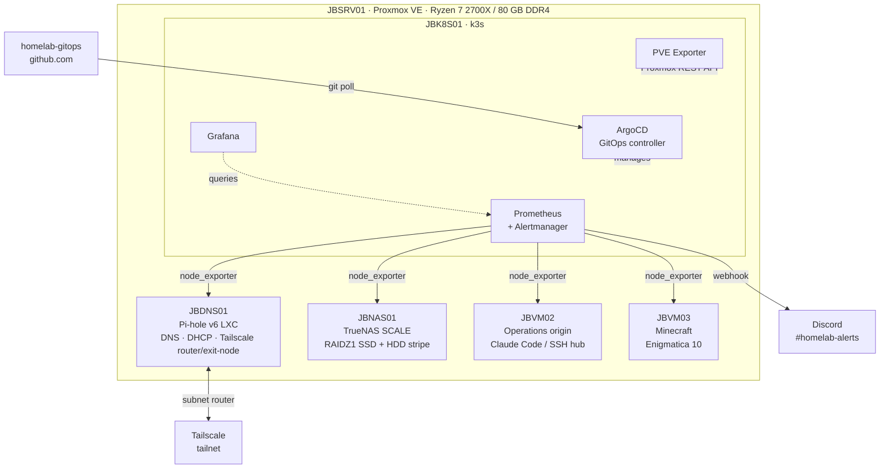

# homelab-gitops

GitOps repository for a single-node homelab built on Proxmox VE. Manages a k3s cluster with a full observability stack deployed via ArgoCD from this repo. The broader homelab stack (network-wide DNS/DHCP, ZFS NAS, Tailscale overlay) is documented here as context for the infrastructure decisions reflected in the cluster config.

Built to develop production-shape platform engineering experience: GitOps workflow, declarative infrastructure, monitoring, and alerting from bare metal upwards.

---

## Architecture



---

## Infrastructure

| Host | Role | OS | Resources |
|------|------|----|-----------|
| JBSRV01 | Proxmox hypervisor | Proxmox VE (Debian) | Ryzen 7 2700X · 80 GB DDR4 |
| JBDNS01 | Pi-hole DNS + DHCP + Tailscale | Debian 12 LXC | 1 vCPU · 512 MB |
| JBNAS01 | TrueNAS SCALE NAS | TrueNAS SCALE 25.04 | 4 vCPU · 12 GB · RAIDZ1 SSD + HDD stripe |
| JBK8S01 | k3s cluster | Ubuntu 24.04 | 4 vCPU · 8 GB · 40 GB |
| JBVM03 | Minecraft (Enigmatica 10) | Ubuntu 24.04 | 6 vCPU · 14 GB |
| JBVM02 | Operations origin | Ubuntu 24.04 | 2 vCPU · 8 GB |

Total guest allocation: 19 vCPU on a 16-thread host, a deliberate mild overcommit (see Design Decisions).

---

## Stack

| Component | Tool | Why |
|-----------|------|-----|
| Hypervisor | Proxmox VE | KVM-based; REST API enables IaC provisioning (OpenTofu target for Phase 3) |
| DNS + DHCP | Pi-hole v6 (LXC) | Network-wide ad-blocking + DHCP takeover; Virgin Media Hub's DHCP disabled entirely; LXC keeps footprint minimal |
| Off-network access | Tailscale | Mesh VPN; single subnet router on JBDNS01 exposes the full LAN without port forwarding or per-host installation |
| NAS | TrueNAS SCALE | ZFS for data integrity and snapshots; two-pool design maps durability requirements to hardware (RAIDZ1 for data, stripe for media) |
| Container orchestration | k3s | Production Kubernetes API surface without kubeadm complexity; includes Traefik, CoreDNS, and metrics-server |
| GitOps | ArgoCD | Declarative cluster state from Git; self-managing via App of Apps; automated sync + prune + selfHeal on every push |
| Metrics + alerting | kube-prometheus-stack | Prometheus + Grafana + Alertmanager stack with CRD-based config that matches production patterns |
| Proxmox metrics | PVE Exporter | Proxy-style scraping of Proxmox host and guest metrics via the Proxmox REST API |
| Dashboards | Grafana + ConfigMap sidecar | Auto-provisioned from Git-tracked ConfigMaps; JSON generated by a checked-in Python script for readable diffs |
| Alert routing | Alertmanager -> Discord | Webhook routing to `#homelab-alerts`; Watchdog heartbeat silenced; k3s-incompatible monitors disabled |

---

## Design Decisions

**NodePort over LoadBalancer for cluster services**
k3s ships Traefik as the default ingress and ServiceLB (klipper-lb) binds it to ports 80 and 443 on the node IP. Any other service with `type: LoadBalancer` on those ports stays `Pending` indefinitely. All non-Traefik services in this repo use `type: NodePort` with explicit port assignments to avoid the conflict.

**`local-path` PV over NFS for persistent volumes**
Mounting NAS-backed NFS as PV storage would make cluster availability depend on NAS availability. On a single Proxmox host, both are VMs; a cascading failure would take down the cluster and its storage simultaneously. `local-path` keeps the failure domain to the k3s VM itself. The trade-off is no live migration, which is acceptable on a single-node cluster.

**Plain YAML for PVE Exporter, not a Helm umbrella chart**
No upstream Helm chart exists in prometheus-community for PVE Exporter. Wrapping a Deployment and a Service in a custom umbrella chart adds abstraction without value. Plain YAML under `charts/pve-exporter/` with an ArgoCD Application that omits the `helm:` block works identically; ArgoCD auto-detects plain YAML.

**Proxy-style Prometheus scraping for Proxmox**
The PVE Exporter follows the [multi-target exporter pattern](https://prometheus.io/docs/guides/multi-target-exporter/): Prometheus sends `GET /pve?target=<proxmox-ip>&module=default` and the exporter calls the Proxmox REST API on behalf of Prometheus. One exporter instance serves metrics for the entire Proxmox host and all guests. The API token lives in a k8s Secret, not in the scrape config.

**Dashboard JSON generated from a checked-in Python script**
Grafana dashboards imported manually through the UI are stored in Grafana's SQLite database; they don't survive a pod replacement or PV wipe. Provisioning via ConfigMaps means the sidecar re-applies all dashboards on every Grafana restart, making dashboard state declarative and version-controlled. The secondary problem is that dashboard JSON exported from the UI runs to 4000+ lines of opaque nested objects; a diff between two versions is unreadable. `charts/dashboards/gen-dashboards.py` generates the ConfigMap YAML from a structured Python definition so a change to a single panel produces a meaningful diff rather than a wall of JSON noise.

**Self-managing ArgoCD**
ArgoCD watches its own Helm values at `charts/argocd/values.yaml`. Upgrades are Git PRs, not manual `helm upgrade` runs. This was the first application applied to the cluster; from that point the cluster's desired state is fully described in Git.

**App of Apps bootstrap**
A root Application at `bootstrap/root-app.yaml` watches the `apps/` directory. Applied once manually on a new cluster; all subsequent applications are live on push. No `kubectl apply` needed for new additions; push an Application manifest to `apps/` and ArgoCD handles the rest.

**Out-of-Git secrets**
The Alertmanager Discord webhook URL and Proxmox API token are held in k8s Secrets created out-of-band. Committing plaintext credentials is never acceptable; the correct fix is Sealed Secrets (cluster-bound encryption, safe to commit) or External Secrets Operator. This is planned for Phase 3. The private rebuild notes document how to recreate them after a cluster wipe.

**vCPU overcommit: 19 vCPU on a 16-thread host**
Minecraft (6 vCPU) and the k8s observability stack (4 vCPU) have non-overlapping peak windows: active play drives chunk generation load while Prometheus scrapes and Grafana queries are off-peak. The overcommit is deliberate and monitored. A CPU upgrade is gated on observing actual MC tick stutter under load, not on paper thread counts.

**Two-pool NAS design**
`JBNAS_SSD` (RAIDZ1, 3x 512 GB SSD) holds general data and project backups; redundancy matters here. `JBNAS_MEDIA` (stripe, 4x HDD) holds the Plex media library; media is re-acquirable, so full capacity at the cost of redundancy is the right trade-off. Different durability requirements, different ZFS topologies.

**Write-only SMB drop pattern**
The jump box mounts the Media share as a restricted identity (`jbannon`) with POSIX ACLs granting `write+execute` on `_inbox/{movies,tv}/` only; it cannot read, list, or overwrite the live library. A cron-driven mover uses atomic renames within the same ZFS dataset to sweep files into `Movies/`/`TV/`, so Plex never sees a partial file. A 100 GB per-user ZFS quota bounds exposure if the jump box identity is compromised.

**Single Tailscale node as subnet router**
Installing Tailscale on every VM would require per-host ACL entries and key rotation across the estate. Instead, JBDNS01 acts as a subnet router advertising `192.168.0.0/24` and as an exit node. One Tailscale node exposes the entire LAN; clients connect with `--accept-routes` and reach every host without Tailscale installed on them.

**Deliberately single-environment GitOps**
This repo has no `environments/` overlay structure; this homelab has one cluster. Production would layer Kustomize overlays (or per-environment Helm value files) over a base config: `base/` -> `overlays/dev/`, `overlays/prod/`. That pattern is intentionally absent here rather than applied for appearances.

---

## Lessons Learned

**`CPUThrottlingHigh` fires even when average CPU usage is negligible**
Symptom: Alertmanager fires `CPUThrottlingHigh` on the PVE Exporter pod; `kubectl top pod` shows roughly 8m average CPU, so the workload appears healthy.
Diagnosis: query `rate(container_cpu_throttled_seconds_total[5m])` in Prometheus directly. If throttle events are high while average usage looks normal, it confirms burst throttling rather than sustained load. The `CPUThrottlingHigh` rule fires when the ratio of throttled time to total scheduled time exceeds 25% over 15 minutes, regardless of average utilisation.
Root cause: `container_cpu_throttled_seconds_total` counts cgroup throttle events, not average utilisation. The Python/gunicorn PVE Exporter spikes CPU on every Prometheus scrape burst; with a `limits.cpu: 100m` ceiling it was rate-limited on nearly every scrape window despite the negligible average.
Fix: raise `limits.cpu` (`100m` -> `500m`). Leave `requests.cpu` unchanged; it drives scheduling, not enforcement. The alert can remain firing for up to 20 minutes after the fix deploys while Prometheus burns down the `for` window and Alertmanager waits out `resolve_timeout`.

**Grafana sidecar reload returns 401 despite correct-looking credentials**
Symptom: sidecar writes dashboard JSON to `/tmp/dashboards/` but dashboards don't appear in the Grafana UI; sidecar logs show `401 Unauthorized` on the provisioning reload API call.
Root cause: during initial deploy ArgoCD cycled multiple Grafana ReplicaSets. Each cycle regenerated the `kube-prometheus-stack-grafana` k8s Secret with a new admin password, but the Grafana SQLite database on the persistent volume retained the original. The Secret and the DB diverged silently; the sidecar's reload call used Secret credentials against a DB that didn't match.
Fix: reset the Grafana admin password via `grafana cli admin reset-admin-password` to match the current Secret value. Note: the Grafana container ships BusyBox `wget`, which lacks `--user`/`--password` flags; use `--header "Authorization: Basic $(echo -n user:pass | base64)"` for scripted API calls against the Grafana HTTP API.

**`prometheus-operator` ignores Secret content changes**
Symptom: new scrape job added to `additionalScrapeConfigs` in `values.yaml`; ArgoCD shows `Synced Healthy`; Secret content is correct in the cluster; the job is absent from the live Prometheus config inside the pod.
Root cause: prometheus-operator reconciles when its CRDs (ServiceMonitor, PodMonitor, PrometheusRule, etc.) change, not when a referenced Secret's content changes. Updating the `additionalScrapeConfigs` Secret alone does not trigger a config reload.
Fix: `kubectl rollout restart deployment kube-prometheus-stack-operator -n monitoring`. The operator re-reads all referenced Secrets on startup.

**Grafana `initChownData` fails on PVs with existing data**
Symptom: Grafana pod stuck in `Init` state on redeploy; init container logs show `chown: changing ownership of '/var/lib/grafana': Operation not permitted`.
Root cause: `initChownData` runs `chown -R 472` on the PV mount, but the container doesn't have sufficient privilege to change ownership of directories written by a previous Grafana process on the same PV.
Fix: disable `initChownData` in Helm values; set `securityContext.fsGroup: 472`. The kernel applies group ownership at mount time, replacing the need for the init container. All Grafana deployments in this repo use this pattern.

**Unprivileged LXC containers can't start Tailscale without a device passthrough**
Symptom: `tailscaled` starts but immediately exits with a TUN device error; no Tailscale interface is created.
Root cause: unprivileged LXCs do not have access to `/dev/net/tun` by default; `tailscaled` requires it to create the VPN tunnel interface.
Fix: add two entries to the LXC config on the Proxmox host (`/etc/pve/lxc/<vmid>.conf`):
```
lxc.cgroup2.devices.allow: c 10:200 rwm
lxc.mount.entry: /dev/net/tun dev/net/tun none bind,create=file 0 0
```
This must be set on the Proxmox host; it cannot be applied from inside the container.

---

## Roadmap

### Phase 1: k3s + observability (complete)
k3s single-node cluster, ArgoCD (self-managing), kube-prometheus-stack (Prometheus + Grafana + Alertmanager), Alertmanager -> Discord routing, PVE Exporter for Proxmox host/guest metrics, node_exporter on all homelab VMs, auto-provisioned Grafana dashboards.

### Phase 2: Logs
- [ ] **Loki**: centralised log aggregation (object storage on NAS via MinIO, or local PV)
- [ ] **OpenTelemetry Collector** DaemonSet: unified log and metrics pipeline for cluster pods
- [ ] **Promtail / OTel shippers** on external hosts (NAS, jump box, operations VM)

### Phase 3: IaC + GitOps polish
- [ ] **Sealed Secrets**: close the out-of-Git secrets gap; credentials become auditable, version-controlled PRs
- [ ] **OpenTofu + Proxmox provider**: VM provisioning as code; replace manual `qm create`
- [ ] **GitHub Actions CI**: Helm lint + YAML validation on every PR

---

## GitOps Workflow

This repo uses the **App of Apps** pattern. A root Application (`bootstrap/root-app.yaml`) watches the `apps/` directory and auto-syncs any Application manifest pushed there.

**Adding a new app:**
1. Create `charts/<appname>/` with your manifests (Helm umbrella chart or plain YAML)
2. Create `apps/<appname>.yaml` as an ArgoCD Application manifest pointing at `charts/<appname>`
3. Push to `main` -> ArgoCD auto-syncs within ~3 minutes

**Force an immediate sync:**
```bash
kubectl annotate application <name> -n argocd argocd.argoproj.io/refresh=normal --overwrite
```

**Current applications:**

| Application | Namespace | Manifest type |
|-------------|-----------|---------------|
| argocd | argocd | Helm umbrella |
| kube-prometheus-stack | monitoring | Helm umbrella |
| pve-exporter | monitoring | Plain YAML |
| dashboards | monitoring | Plain YAML (ConfigMaps) |

---

## Bootstrap

The full rebuild procedure (VM provisioning, cloud-init, k3s, Helm, ArgoCD, secrets recreation) is in the private homelab docs at `docs/jbk8s01.md`.

On an existing cluster, bootstrap this repo in two steps:

```bash
# 1. Apply the root Application (once per cluster lifetime)
kubectl apply -f bootstrap/root-app.yaml
# ArgoCD deploys everything in apps/ automatically from this point

# 2. Recreate out-of-Git secrets (not in this repo)
#    monitoring/alertmanager-main      Alertmanager Discord webhook config
#    monitoring/pve-exporter-config    Proxmox API token
```
